# Striptease

Sexy, audio-responsive effects on LED strips.

For [Teensy 4](https://www.pjrc.com/store/teensy40.html) with [Audio Adapter Board](https://www.pjrc.com/store/teensy3_audio.html), by [PJRC](https://www.pjrc.com).

## Quick demo

Shooting video of LEDs is tricky. Getting the right exposure, the right focus and the right colors is not easy at all.

This new video should be closer to the "live" version from my couch :-)

One of my favorite effects (DeepSpace), not shown in previous video.

# Intro

I **love** lights, especially LED lights.

The main goals of this library are:

- to simplify the development of visual effects to be rendered on LED strips, by providing useful abstractions and helpers
- to provide runtime support for rendering simultaneous effects on multiple strips, controlling the transitions and adjusting parameters in real time

# Credits

This work has been inspired by some very cool projects published on the [Cine-Lights](https://www.youtube.com/channel/UCOG6Bi2kvpDa1c8gHWZI5CQ) YouTube channel.
Some of the effects still keep the same name as originally given by the author, even though they have been reimplemented from scratch and might look very different.

# Hardware

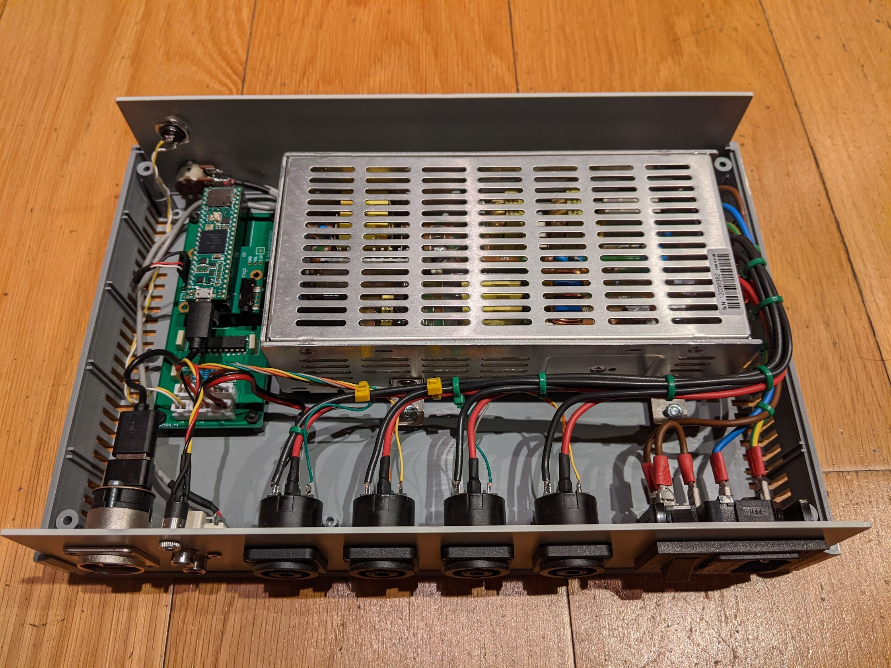

## Teensy

This library is designed around the awesome Teensy 4 Development Board, available as [Teensy 4.0](https://www.pjrc.com/store/teensy40.html) or [Teensy 4.1](https://www.pjrc.com/store/teensy41.html), which has been chosen for a number of reasons:

- It's an extremely capable Arduino-compatible board, running an ARM Cortex-M7 at 600 MHz with a float point math unit, 64 & 32 bits;
- It can be combined with the [Audio Adapter Board](https://www.pjrc.com/store/teensy3_audio.html) for audio I/O and processing;
- It comes with a large set of libraries including two great ones by Paul Stoffregen (Audio and WS2812Serial), described below;
- It's relatively cheap, compared to what it offers.

## Audio Board

The Audio Adapter Board **rev. D** (specific for Teensy 4.x) provides CD-quality stereo ADC/DAC and hardware processing of audio signals.
An optional microphone can be soldered to the board to provide software-switchable mono microphone input, in addition to stereo line input.

Teensy 4.0 provides five serial ports suitable for non-blocking LED driving, while Teensy 4.1 provides a total of eight.
However, when using the Audio Adapter Board, Serial2 and Serial5 are unavailable, leaving us with three channels for Teensy 4.0 and six for Teensy 4.1.

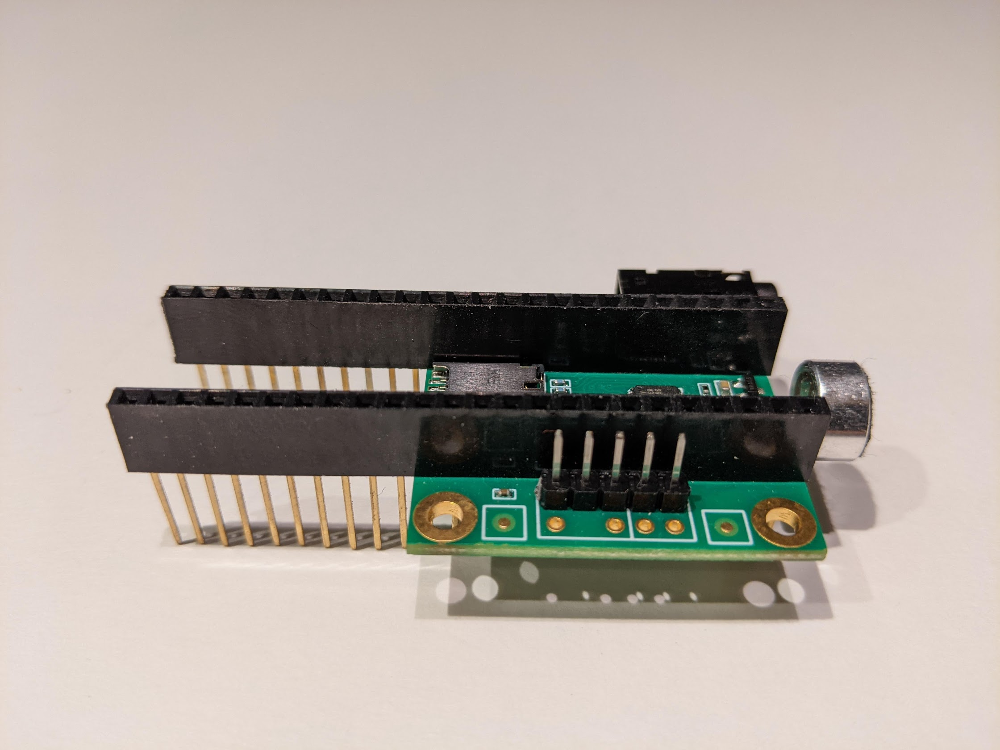

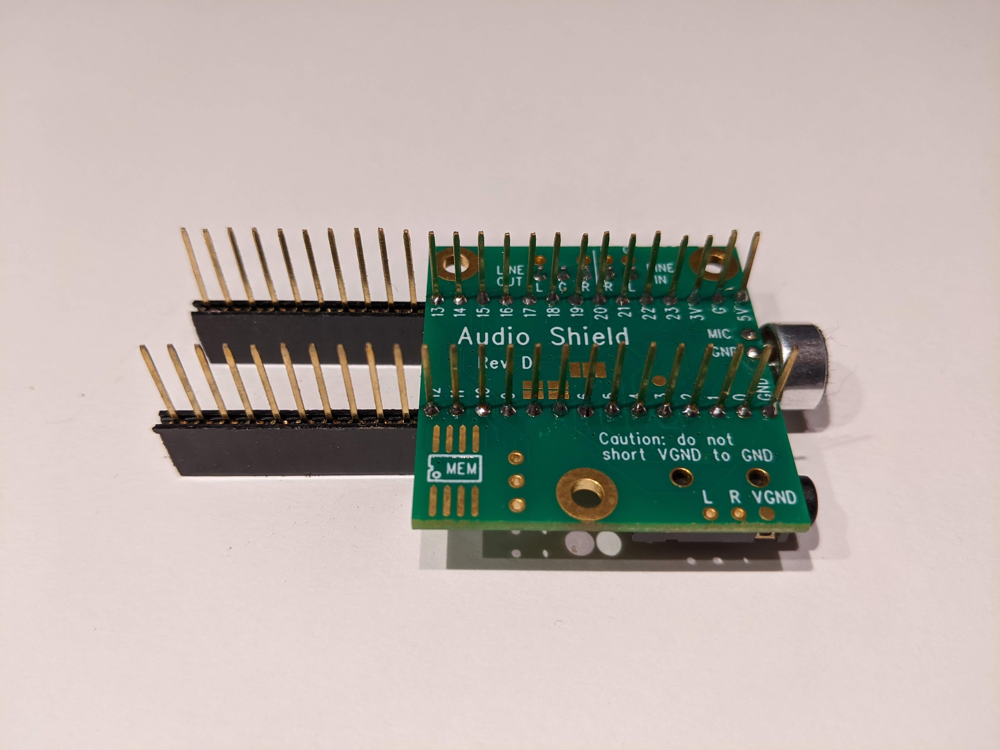

## Level shifter

Teensy 4 internal voltage is 3.3v and all I/O ports operate exclusively at this voltage, thus a level shifter (74HCT245) is required to reliably drive WS2812B LEDs with 5v signals.

## Main board
    
I've designed a couple of custom PCBs, available in the *hardware* directory: one for Teensy 4.0, the other one for Teensy 4.1, housing connectors (power, IR receiver and LEDs), the DIL socket for the 74HCT245 IC, and a pair of stripline sockets for the Teensy, plus a few passive components. The Audio Adapter Board is sandwiched between the main board and the Teensy using long-terminal stripline connectors soldered to the Audio Adapter Board.

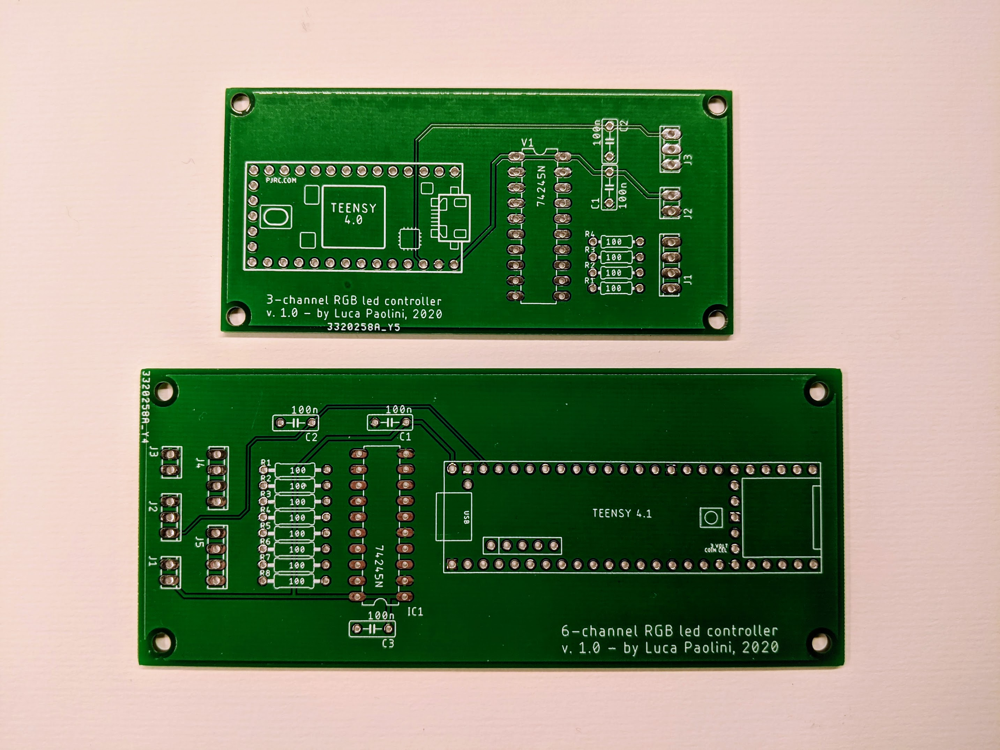

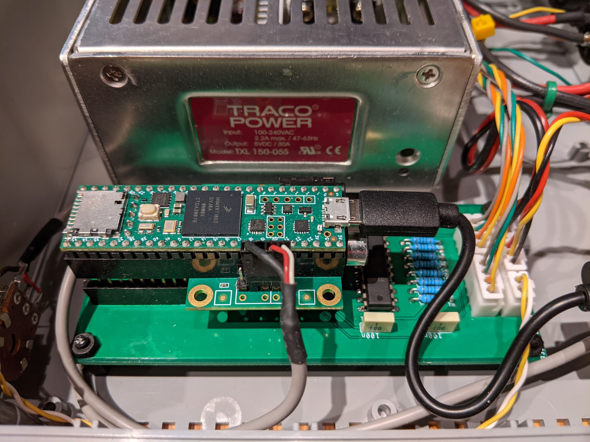

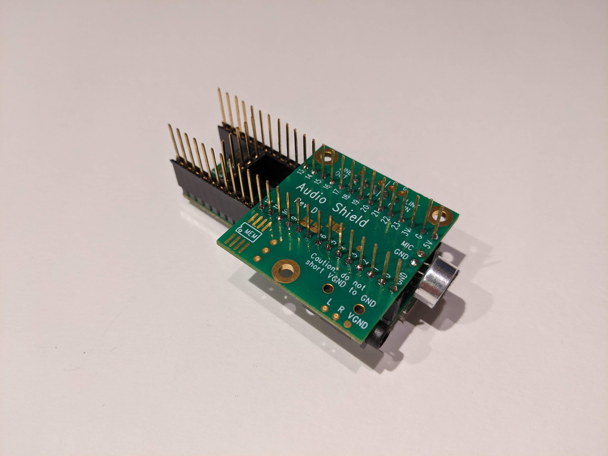

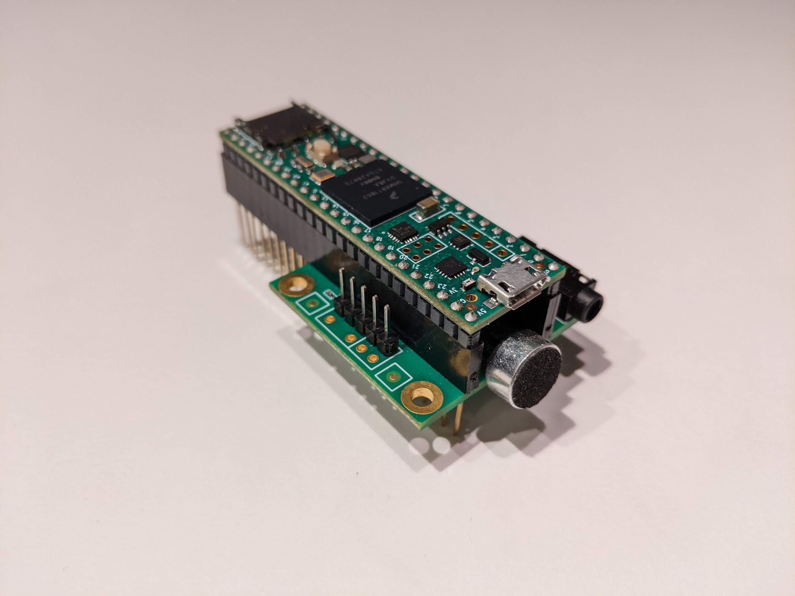

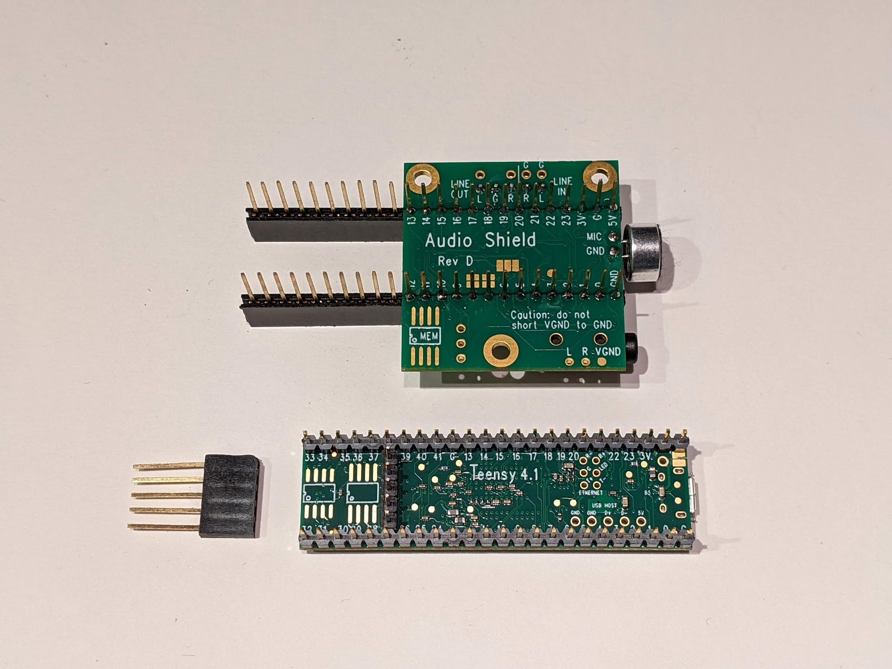

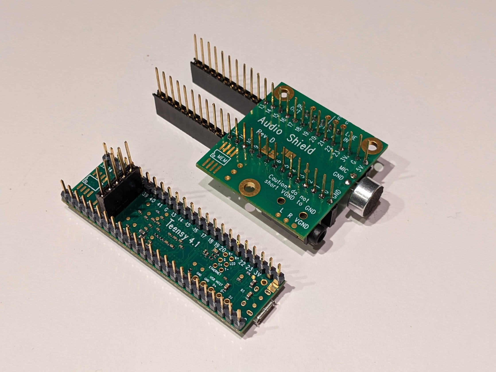

PCBs have been designed using [EAGLE PCB](https://www.autodesk.com/products/eagle) and built by [JLCPCB](https://jlcpcb.com/).

### Main board connectors - Teensy 4.0 version (3 channels)

- J1: LEDs (Ch1, Ch2, Ch3, Ch3)
- J2: Power (GND, +5v)
- J3: IR receiver (GND, Data, +3.3v)

### Main board connectors - Teensy 4.1 version (6 channels)

- J1: Power (GND, +5v)
- J2: IR receiver (GND, Data, +3.3v)
- J3: Reset button
- J4: LEDs (Ch1, Ch2, Ch3, Ch4)
- J5: LEDs (Ch5, Ch6, Ch6, Ch6)

## WS2812B LED strips

For my projects I prefer the high density WS2812B LED strips (144 LED/m) with semi-transparent diffuser, because they look amazing on the short distance.
I'm providing photos of the diffuser on top of a printed page, to give you an idea of the transparency.

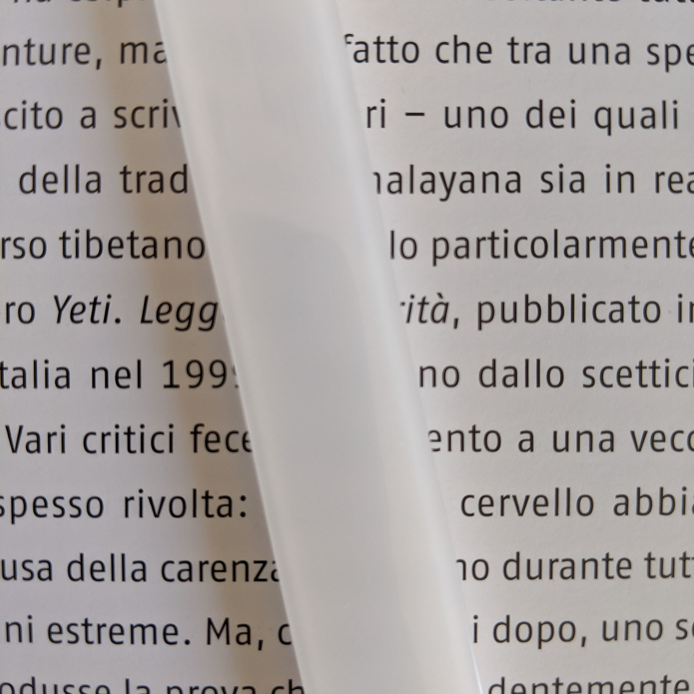

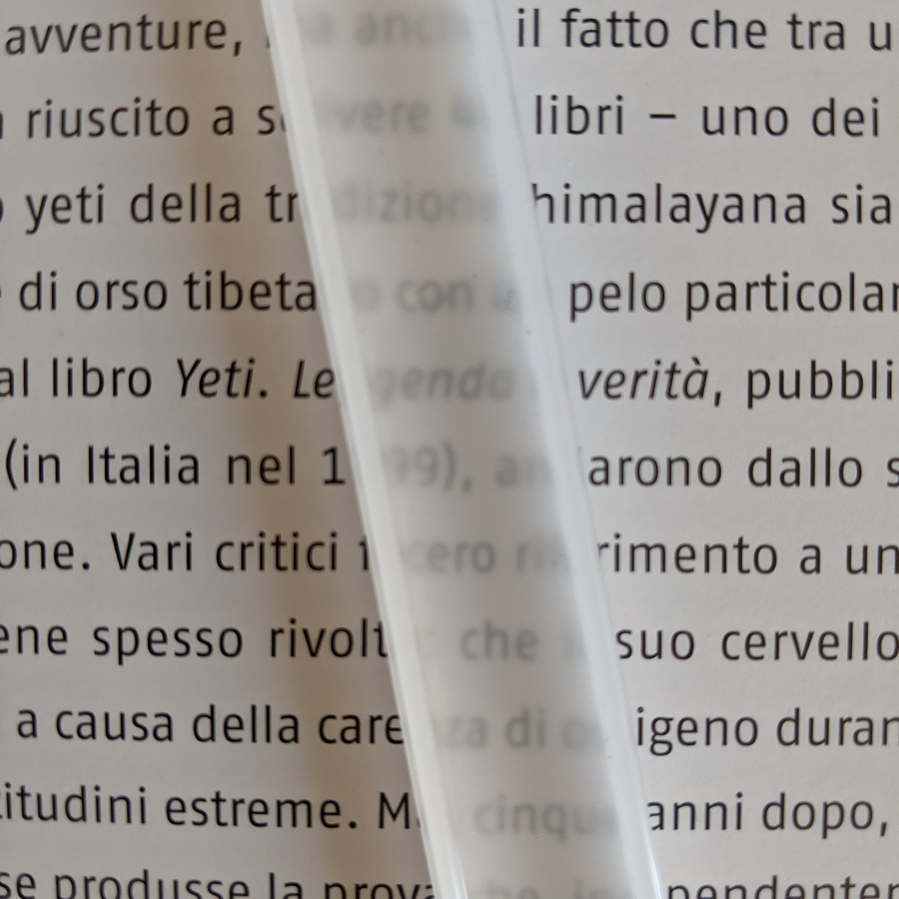

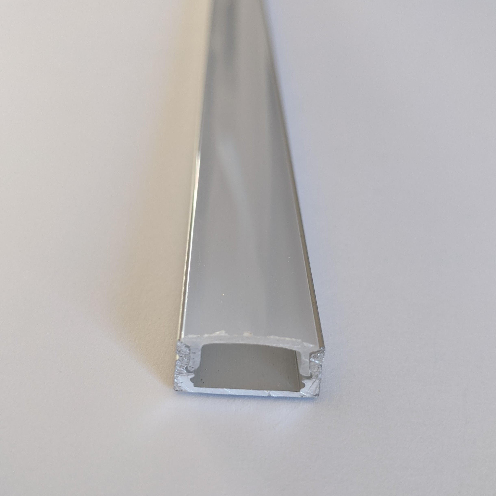

### Update rate (FPS)

Strips can be any lenght and they don't need to be matched.
However, being channels driven in parallel, the global update rate is the update rate of the longest strip.
Update rate can be calculated multiplying the time required for transmitting RGB data for a single WS2812B LED (30us) by the number of the LEDs in the strip.
With 6 channels available, up to 3324 LEDs can be driven at 60fps, or up to 1662 at 120fps.
In my home application (about 800 LEDs), the longest strip has 192 LEDs, which translates to about 170fps.

### Powering LEDs

Please be aware that the power rails on the strips have a non-negligible resistance, which would inevitably cause a voltage drop over distance.
The higher the current, the higher the voltage drop (ohm's law).
Total current is the sum of the current flowing through individual LEDs, which in turn depends on the RGB values. 
So, depending on the instantaneous state of the LEDs in the strip, the voltage drop could be enough to cause malfunctioning.
To overcome this problem, you might need to *inject* power also at the end of the strip and, if it's very long, every n LEDs (n to be determined).

Personally, I never had to do this, even when driving 240 LEDs at full brightness, but copper thickness of the power rails might differ from one producer to another.

## Power supply

I suggest using excellenty quality power supplies. A faulty one can easily destroy your hardware and can even become a threat for your life! 

One of my favorite brands is [Traco Power](https://www.tracopower.com/).

## Connectors

For connecting strips to the controller I use [Neutrik](https://www.neutrik.com) speakON connectors: [NL4FX](https://www.neutrik.com/en/product/nl4fx) on the cable and [NL4MP](https://www.neutrik.com/en/product/nl4mp) on the controller.

They are super reliable connectors designed for connecting audio amplifiers to speakers, but they work amazingly well for this purpose too. Current rating is 40A (continuous) and they have four contacts, so one connector can bring power and signals to two strips using a 4-wire cable.

## Infrared receiver

Any common infrared receiver, TSOP4838 or similar, would be fine.
In my projects I'm using an external one (search for "infrared extender cable"), as they usually come with a convenient red filter which increases the sensitivity by removing unwanted wavelenghts.

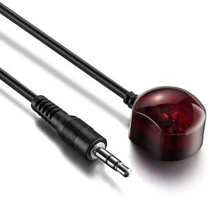

# Software

Code is built around four *awesome* libraries:

- [FastLED](https://github.com/FastLED/FastLED), for LED animation
- [WS2812Serial](https://github.com/PaulStoffregen/WS2812Serial), for non-blocking driving of WS28128B LEDs
- [Audio](https://github.com/PaulStoffregen/Audio), for sophisticated real time processing of audio signal
- [IRMP](https://github.com/ukw100/IRMP), for decoding IR remote controller codes (basically any spare remote can be adapted)

## Architecture

Code has been crafted carefully, splitting responsibilites across a number of classes and introducing several useful abstractions.

All effects:

- are self-contained (all state is in own private class members)
- don't depend on strip length (they adapt to strip length or use normalized addressing)
- don't depend on main loop frequency (they rely on timers so that animation speed doesn't depend on global update rate)

## Caveats

Teensy 4 is a very powerful device. It supports floating point math in hardware with no performance penalty, so I've decided to free myself from the burden of using integer math for representing decimal values. Also, it has got plenty of flash and RAM, so I've also traded code size and extreme performance optimizations with cleaner code structure.

# API

## Strip

*Strip* is a wrapper to a FastLED CRGBArray, providing convenience methods for absolute (integer, 0 to pixel count - 1) or normalized (float, 0 to 1) LED addressing.
It makes it easier to manipulate strips in a length-agnostic way.

## Fx

*Fx* is the abstract class you'll need to extend for defining your effects (see *Implementing your effects*).

It defines the abstract methods to be implemented by any effect:
- reset(), called once when the effect is selected or reset;
- loop(), called by the main loop when the effect is selected.

## Stage

*Stage* is the abstract class you'll need to extend for defining your setup (see *Implementing your stage*).
It provides methods for adding strips and effects to your stage and to data to the *Controller*.
It is also the right place for calling native FastLED methods for setting color correction and maximum allowed power, to comply with your power supply limits.
Please do not call FastLED.setBrightness(..) as global brightness is handled by *Brightness*.

Two sample implementations are provided in the *examples* directory:
- *example1* (4 channels on Teensy 4.1) is my current living room setup: the *left* and *right* strips (192 leds, 144 led/m) are placed side by side in a single 2.7m long aluminium bar between a piece of furniture (where the tv set is placed) and the floor, pointing outwards, while the *top* strip (169 leds, 60 led/m) is placed on the wall (behind the tv set) at about half a meter from ceiling, pointing upwards. Well, there's a fourth strip called *xmasTree*, guess what it is :-)
- *example2* (2 channels on Teensy 4.0) is my kids' room setup :-)

## Multiplex

*Multiplex* is a virtual effect (it implements the *Fx* interface) which combines up to six effects to be played in parallel, usually on distinct channels, as if they were one.

## Controller

*Controller* exposes high-level actions for the remotes to invoke (e.g. *play*, *pause*, *stop*, *increaseBrightness*, etc.).
It takes care of displaying the selected effect, cycling effects in manual or timed mode, loading and storing effect speed from non-volatile memory and for temporarily displaying systems effects (e.g. for setting input level, cycle speed, effect speed, etc.)

### void toggleInput()
Enter input sensitivity setting mode.
If already in input sensitivity setting mode, toggle stereo line input / mono microphone input.

When in input sensitivity setting, a virtual slider fx replaces the currently selected fx for providing a visual indication of:
- current input sensitivity
- current audio signal peak and peak hold
- beat detected (peak hold indicator turn cyan)
- clipping detected (peak hold indicator turns red)

### void increaseInputSensitivity()
Enter input sensitivity setting mode.
If already in input sensitivity setting mode, increase the sensitivity for the active input.

### void decreaseInputSensitivity()
Enter input sensitivity setting mode.
If already in input sensitivity setting mode, decrease the sensitivity for the active input.

### void reset()
Reset current effect.

### void increaseBrightness()
Increase global brightness.

### void decreaseBrightness()
Decrease global brightness.

### void setParam(uint8_t value)
Set a numeric value for the current parameter (can be effect number, input sensitivity, etc., depending on current context).

### void increaseParam()
Increase the current parameter (can be effect number, input sensitivity, etc., depending on current context).

### void decreaseParam()
Decrease the current parameter (can be effect number, input sensitivity, etc., depending on current context).

### void selectFx(uint8_t fx)
Select fx by index number.

### void selectPreviousFx()
Select previous fx.

### void selectNextFx()
Select next fx.

### void selectRandomFx()
Select a random fx.

### void play()
Enter timed play mode (either sequential or shuffle, based on last selection).

### void sequential()
Enter timed/sequential play mode.

### void shuffle()
Enter timer/shuffle play mode.

### void pause()
Enter manual play mode.

### void playPause()
Toggle timed/manual play mode.

### void stop()
Fade out all strips and enter stop mode.

### void cycleSpeed()
Enter cycle speed setting mode.

A virtual slider fx replaces the currently selected fx for providing a visual indication of the current value.

In this mode setParam(0..10), increaseParam() and decreaseParam() can be used to change the value.

### void setCycleSpeed(uint8_t speed)
Enter cycle speed setting mode and set cycle speed (0..10).

When in cycle speed setting mode, a virtual slider fx replaces the currently selected fx for providing a visual indication of the current value.

### void increaseCycleSpeed()
Enter cycle speed setting mode and increase cycle speed.

### void decreaseCycleSpeed()
Enter cycle speed setting mode and decrease cycle speed.

### void fxSpeed()
Enter fx speed setting mode.

When in fx speed setting mode, a virtual slider fx replaces the currently selected fx for providing a visual indication of the current value.

### void setFxSpeed(uint8_t speed)
Enter fx speed setting mode and set cycle speed (0..10).

### void increaseFxSpeed()
Enter fx speed setting mode and increase fx speed.

### void decreaseFxSpeed()
Enter fx speed setting mode and decrease fx speed.

## State

Effects running in parallel on distinct strips are independent instances with no shared data.

*State* keeps shared, read-only state for use by any effect (mainly a couple of *rotating hue* values).

## AudioChannel

*AudioChannel* consumes peak, rms and fft readings provided by the Audio library for the three channels (left, right and mono), and exposes them along with derived indicators: peakSmooth, peakHold, signalDetected, beatDetected, clipping.

### Beat detection

Beat detection is implemented by feeding an instance of *PeakDetector* with rms values, which represent the energy content of the signal.
Input values are stored in a circular buffer, on which moving average and standard deviation are calculated and used for discriminating peaks with sufficient energy from normal signal fluctuations.

## Remote

*Remote* is the abstract class you'll need to extend for supporting your infrared remote.
Basically, its purpose is to match remote keypresses with *Controller* high-level actions.

In the provided examples I'm using a Sony RM-D420, but more or less any spare remote can be used.

For adding your remote you'll need to:
- flash the [IRMP AllProtocols](https://github.com/ukw100/IRMP/tree/master/examples/AllProtocols) example (be sure to change input pin to 22)
- take note of the code detected for each keypress on the remote
- extend the provided [Remote](src/Remote.h) class with your implementation (e.g. MyRemote.h), matching *Controller* actions with remote keys.

See SonyRemote_RMD420.h in [example1](examples/example1) or [example2](examples/example2) as a reference.

### Important

- *Remote* implementation, because of some some limitation of the IRMP library, **must be self-contained in the .h file** (it cannot be split in .h/.cpp files).
- Add the relevant **#define** for enabling the your remote's IR protocol (see IRMP documentation) **before importing the library**, i.e. at the top of main.cpp.

## Brightness

*Brightness* controls... global brightness.
It also takes care of rendering quick flases for providing a visual feedback of buttons pressed on the remote control.

## HarmonicMotion

The foundation for the majority of the effects implemented so far is the *HarmonicMotion* class, which implements physics for the [harmonic motion](https://en.wikipedia.org/wiki/Simple_harmonic_motion). It emulates the behavior of an object linked with a spring and a damper to a fixed point, with given initial position, fixed point position, velocity, acceleration, elastic constant of the spring, damping, lower and upper bounds with rebound coefficients.
External acceleration (e.g. gravity) is also supported.

Additionally, it provides methods for setting critical damping (no oscillations) or detecting when the system has reached a reasonably stable state (i.e. not moving anymore because all energy has been dissipated or because it's locked in a boundary position).

For semplicity the harmonic motion equation is normalized in respect to the mass, which is always equal to 1.

With proper settings of parameters, a large spectrum of behaviors can be represented.
Here is a short list of some common ones:
- infinite oscillation (elastic constant > 0, damping = 0, position != fixed-point position and/or velocity != 0)
- damped oscillation (elastic constant > 0, damping > 0, position != fixed-point position and/or velocity != 0)
- critical damping (elastic constant > 0, damping = critical, position != fixed-point position and/or velocity != 0)
- constant speed (elastic constant = 0, damping = 0, acceleration = 0, velocity != 0)
- constant acceleration (elastic constant = 0, damping = 0, acceleration != 0)
- speed-limited acceleration (elastic constant = 0, damping > 0, acceleration != 0)

Acceleration can be set up to the third order, using 1, 2 or 3 coefficients:
- a1: first order acceleration (constant)
- a2: second order acceleration (acceleration of a1)
- a3: third order acceleration (acceleration of a2)

The object can be rendered in different ways, which can be combined. It can:
- be *mirrored*:, for rendering twin objects symmetrical in respect to the fixed point;
- be *filled* , for filling the segment between the object (or the two objects, if mirrored) and the fixed point with color;
- have a *range*, for rendering the object (or the two objects, if mirrored) as a segment with given starting and ending offset (e.g. a range -2 to 5 renders a segment starting 2 pixels before the nominal position and ending 5 pixels after).

Lower and upper bounds can be set with the respective rebound coefficients (r), for instantaneously changing the speed by multiplying it by the rebound factor:
- r < -1: instantaneous rebound with speed increase
- r = -1: instantaneous perfect rebound
- -1 > r > 0: instantaneous rebound with speed decrease
- r = 0: instantaneous stop (default)
- 0 > r > 1: instantaneous speed decrease
- r = 1: invisible bound (no speed change)
- r > 1: instantaneous speed increase

When setting bounds, a third parameter (b) can be specified for specifying the boundary of the object to be used as a trigger:
- b = 0: the nominal position (default)
- b = -1: the outer edge of the segment (for triggering when the segment is completely within the bound)
- b = 1: the inner edge of the segment (for triggering when the segment is completely past the bound)

Some very weird behavior can be obtained by using values not possible in the real world, like negative elastic constant, negative damping, or rebound coefficients whose absolute value is greater than one.

Please note all parameters can be changed during the animation (in the *loop* method) for implementing discontinuities or any kind of non-standard behavior.

Most effects use arrays of *HarmonicMotion* instances. A single Teensy 4 can animate a huge number of them at the same time, for very complex animations.

### HarmonicMotion& setup(Strip *strip);
Initialize an HarmonicMotion instance with a Strip pointer.

### HarmonicMotion& reset();
Reset all parameters to default value.

### HarmonicMotion& setColor(CRGB color = CRGB::White);
Set color of the object.

### HarmonicMotion& setAcceleration(float a0, float a1 = 0, float a2 = 0);
Set acceleration, by providing a0 and optional higher order acceleration constants.

### HarmonicMotion& setElasticConstant(float k);
Set elastic constant of the spring.

### HarmonicMotion& setDamping(float b);
Set damping.

### HarmonicMotion& setCriticalDamping();
Set damping to critical damping value (2 * sqrt(k)).

### HarmonicMotion& setPosition(float x);
Set position of the object.

### HarmonicMotion& setVelocity(float v);
Set velocity of the object.

### HarmonicMotion& setFixedPointPosition(float x0);
Set fixed point position.

### HarmonicMotion& setUpperBound(float x, float r = 0, int8_t boundTrigger = 0);
Set upper bound, with optional rebound and bound trigger.

Bound trigger only makes sense when a range is used (i.e. a segment is rendered vs a single pixel).
Its value determines when the bound is triggered:
- 0: bound is triggered when the nominal position reaches the bound (default)
- 1: bound is triggered when the starting position of the range reaches the bound (i.e. the segment is entirely **past** the bound)
- -1: bound is triggered when the ending position of the range reaches the bound (i.e. the segment is entirely **within** the bound)

### HarmonicMotion& setLowerBound(float x, float r = 0, int8_t boundTrigger = 0);
Set lower bound, with optional rebound and bound trigger.

Bound trigger only makes sense when a range is used (i.e. a segment is rendered vs a single pixel).
Its value determines when the bound is triggered:
- 0: bound is triggered when the nominal position reaches the bound (default)
- 1: bound is triggered when the ending position of the range reaches the bound (i.e. the segment is entirely **past** the bound)
- -1: bound is triggered when the starting position of the range reaches the bound (i.e. the segment is entirely **within** the bound)

### HarmonicMotion& setRange(int start, int end);
Set the starting and ending offset of the segment to be rendered (instead of a single point), in respect to the nominal position.

### HarmonicMotion& setMirror(bool mirror);
Set mirrored mode (twin objects symmetrical to the fixed point).

### HarmonicMotion& setFill(bool fill);
Set fill mode (fill the segment between the object nominae position and the fixed point position with color.

### HarmonicMotion& setShowWhenStable(bool showWhenStable);
Show or hide the object when its position is stable.

### HarmonicMotion& setOverwrite(bool overwrite);
Add or overwrite existing color data.

### float getPosition();
Get current object position.

### float getNormalizedPosition();
Get current object normalized position (0 to 1).

### float getVelocity();
Get current object velocity.

### float getFixedPointPosition();
Get current fixed point position.

### bool isStable();
Detect if position is stable (not moving anymore).
Position is considered to be stable when one of the following conditions become true:
- both the overall force and velocity are negligible
- the overall force is negative, the object is locked at lower bound and velocity is negligible
- the overall force is positive, the object is locked at upper bound and velocity is negligible

### void loop();
Main loop.

### Method chaining

All setters return the current instance, for easy chaining of methods.

The following example would animate a 6-pixel red segment starting at position 0 with random speed between 100 and 200 pixel/s, rebounding past the upper bound and stopping within the lower bound.

    item.reset()
        .setColor(CRGB::Red)
        .setPosition(0)
        .setVelocity(random8(100, 200))
        .setUpperBound(strip->count - 1, -1, 1)
        .setLowerBound(0, 0, -1)
        .setRange(0, 5);

# Implementing new effects

You can create new effects by extending the *Fx* class.

I suggest you to look at the provided effects, as they are self contained, quite compact in size, and supposedly easy to understand.
        
# Implementing your stage

You can implement your own stage by extending the *Stage* class.
See provided examples as a reference.

# Feedback

Please be free to contact me, open issues and submit PRs.

Happy Stripteasing! :-)
